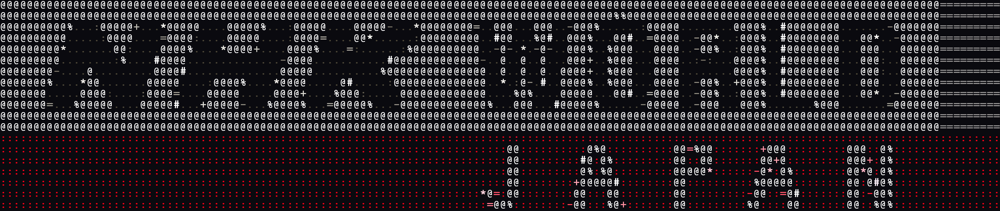

# NHK-TS

A specialised command-line tool designed for archivists and enthusiasts to manage their NHK World Japan TVHeadEnd satellite recordings. This tool automates the process of identifying programme boundaries, managing metadata, and optimising recordings for modern media servers.

## Key Features

- 🎯 **Precise Programme Detection**: Identifies exact programme start and end times by analysing both black screens and silent periods during the first and last few minutes of recordings
- 📺 **TVDB Integration**: Automatically retrieves and parses programme names, years, and episode information from TheTVDB
- 💾 **Intelligent Caching**: Minimises TVDB API requests by caching programme metadata
- 🎬 **Format Optimisation**: Transcodes 1080i interlaced content into 1080p progressive format
- 📦 **Flexible Output**: Supports both MKV and MP4 containers for compatibility with:
  - Plex
  - Jellyfin
  - Emby
  - VLC
  - Kodi
  - MPV
  - Other modern media players

## How It Works

### Programme Detection
The tool uses a two-step process to identify programme boundaries:

1. **Black Frame Analysis**
   - Scans the first 90 seconds and last 210 seconds of each recording (configurable)
   - Uses ImageMagick to detect black frames and programme logos
   - Compares frames against a reference image to identify programme transitions

2. **Audio Analysis**
   - Detects silent periods using FFmpeg's silencedetect filter
   - Threshold: -80dB with minimum duration of 1.0 seconds (configurable)
   - Combines audio and video analysis for accurate boundary detection

### Metadata Management
- Automatically extracts programme information from custom TVHeadEnd `.nfo` files
- Queries TheTVDB API to enrich metadata with:
  - Programme titles
  - Episode numbers
  - Air dates
  - Series information
- Implements intelligent caching to minimise API calls
- Rate limits requests to comply with TVDB's API restrictions
- Uses Dice-Sørensen coefficient for fuzzy matching of programme descriptions
  - Helps match programmes even with slight variations in titles or descriptions, including punctuation
  - Threshold of 0.8 (80% similarity) for positive matches

### Transcoding Process
- Converts 1080i interlaced content to 1080p progressive format
- Supports ffmpeg quality presets
- Maintains original audio streams
- Outputs to either MKV or MP4 containers
- Uses CRF (Constant Rate Factor) for quality control

## Wiki

For detailed information, frequently asked questions, installation instructions, and more, please refer to the [GitHub Wiki](https://github.com/UpperCenter/nhk-ts/wiki).